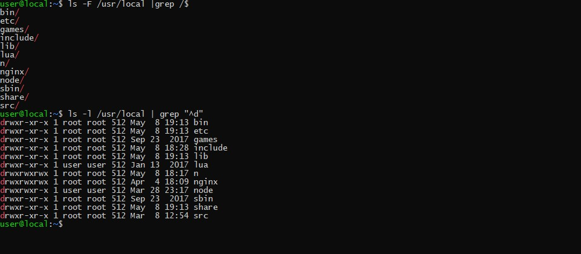
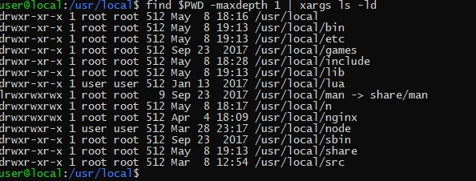
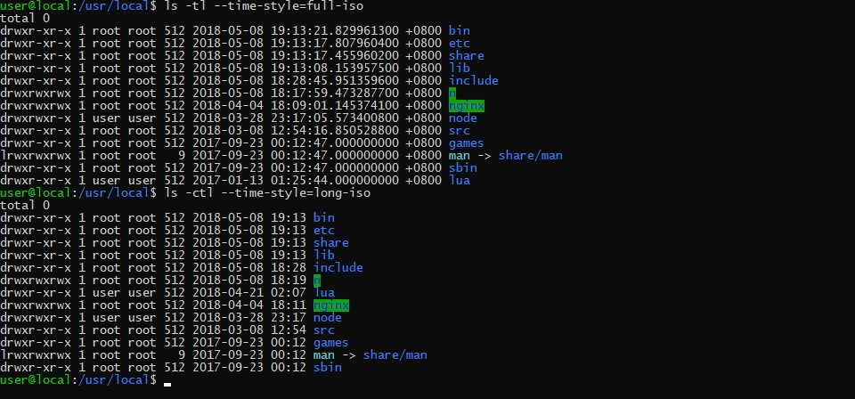

# ls

ls 命令是 linux 下最常用的命令。ls 命令就是 list 的缩写  缺省下 ls 用来打印出当前目录的清单  如果 ls 指定其他目录  那么就会显示指定目录里的文件及文件夹清单。 通过 ls 命令不仅可以查看 linux 文件夹包含的文件  而且可以查看文件权限(包括目录、文件夹、文件权限) 查看目录信息等等。ls 命令在日常的 linux 操作中用的很多！

## 命令格式：

`ls [选项] [目录名]`

## 命令功能：

列出目标目录中所有的子目录和文件。

## 常用参数：

- -a, –all 列出目录下的所有文件，包括以 . 开头的隐含文件
- -A 同-a，但不列出“.”(表示当前目录)和“..”(表示当前目录的父目录)。
- -c 配合 -lt：根据 ctime 排序及显示 ctime (文件状态最后更改的时间)配合 -l：显示 ctime 但根据名称排序否则：根据 ctime 排序
- -C 每栏由上至下列出项目
- –color[=WHEN] 控制是否使用色彩分辨文件。WHEN 可以是'never'、'always'或'auto'其中之一
- -d, –directory 将目录象文件一样显示，而不是显示其下的文件。
- -D, –dired 产生适合 Emacs 的 dired 模式使用的结果
- -f 对输出的文件不进行排序，-aU 选项生效，-lst 选项失效
- -g 类似 -l,但不列出所有者
- -G, –no-group 不列出任何有关组的信息
- -h, –human-readable 以容易理解的格式列出文件大小 (例如 1K 234M 2G)
- –si 类似 -h,但文件大小取 1000 的次方而不是 1024
- -H, –dereference-command-line 使用命令列中的符号链接指示的真正目的地
- –indicator-style=方式 指定在每个项目名称后加上指示符号<方式>：none (默认)，classify (-F)，file-type (-p)
- -i, –inode 印出每个文件的 inode 号
- -I, –ignore=样式 不印出任何符合 shell 万用字符<样式>的项目
- -k 即 –block-size=1K,以 k 字节的形式表示文件的大小。
- -l 除了文件名之外，还将文件的权限、所有者、文件大小等信息详细列出来。
- -L, –dereference 当显示符号链接的文件信息时，显示符号链接所指示的对象而并非符号链接本身的信息
- -m 所有项目以逗号分隔，并填满整行行宽
- -o 类似 -l,显示文件的除组信息外的详细信息。
- -r, –reverse 依相反次序排列
- -R, –recursive 同时列出所有子目录层
- -s, –size 以块大小为单位列出所有文件的大小
- -S 根据文件大小排序
- –sort=WORD 以下是可选用的 WORD 和它们代表的相应选项：

```
    extension -X status -c
    none -U time -t
    size -S atime -u
    time -t access -u
    version -v use -u
```

- -t 以文件修改时间排序
- -u 配合 -lt:显示访问时间而且依访问时间排序

```
    配合 -l:显示访问时间但根据名称排序
    否则：根据访问时间排序
```

- -U 不进行排序;依文件系统原有的次序列出项目
- -v 根据版本进行排序
- -w, –width=COLS 自行指定屏幕宽度而不使用目前的数值
- -x 逐行列出项目而不是逐栏列出
- -X 根据扩展名排序
- -1 每行只列出一个文件
- –help 显示此帮助信息并离开
- –version 显示版本信息并离开

## 常用范例：

### 1. 列出/home/user 文件夹下的所有文件和目录的详细资料

- 命令：`ls -l -R /home/user`

  在使用 ls 命令时要注意命令的格式：在命令提示符后，首先是命令的关键字，接下来是命令参数，在命令参数之前要有一短横线`-`，所有的命令参数都有特定的作用，自己可以根据需要选用一个或者多个参数，在命令参数的后面是命令的操作对象。在以上这条命令`ls -l -R /home/user`中， **_ls_** 是命令关键字， **_-l -R_** 是参数， _/home/user_ 是命令的操作对象。在这条命令中，使用到了两个参数，分别为 **_l_** 和 **_R_** ，当然，你也可以把他们放在一起使用，如下所示：

- 命令：`ls -lR /home/user`

  这种形式和上面的命令形式执行的结果是完全一样的。另外，如果命令的操作对象位于当前目录中，可以直接对操作对象进行操作;如果不在当前目录则需要给出操作对象的完整路径，例如上面的例子中，我的当前文件夹是 user 文件夹，我想对 home 文件夹下的 user 文件进行操作，我可以直接输入 `ls -lR user`，也可以用 `ls -lR /home/user`。

### 2. 列出当前目录中所有以“t”开头的目录的详细内容，可以使用如下命令：

- 命令：`ls -l t*`

  可以查看当前目录下文件名以“t”开头的所有文件的信息。其实，在命令格式中，方括号内的内容都是可以省略的，对于命令 ls 而言，如果省略命令参数和操作对象，直接输入“ ls ”，则将会列出当前工作目录的内容清单。

### 3. 只列出文件下的子目录

- 命令：`ls -F /usr/local |grep /$`

  列出 /usr/local 文件下面的子目录

- 命令：`ls -l /usr/local | grep "^d"`

  列出 /usr/local 文件下面的子目录详细情况

  

### 4. 列出目前工作目录下所有名称是 s 开头的档案，愈新的排愈后面，可以使用如下命令：

- 命令：`ls -ltr s*`

  

### 5. 列出目前工作目录下所有档案及目录;目录于名称后加"/", 可执行档于名称后加"\*"

- 命令：`ls -AF`

  

### 6. 计算当前目录下的文件数和目录数

- 命令：

  `ls -l * |grep "^-"|wc -l` ---文件个数

  `ls -l * |grep "^d"|wc -l` ---目录个数

### 7. 在 ls 中列出文件的绝对路径

- 命令：`ls | sed "s:^:`pwd`/:"`

  

### 8. 列出当前目录下的所有文件（包括隐藏文件）的绝对路径， 对目录不做递归

- 命令：`find $PWD -maxdepth 1 | xargs ls -ld`

  

### 9. 递归列出当前目录下的所有文件（包括隐藏文件）的绝对路径

- 命令： `find $PWD | xargs ls -ld`

### 10. 指定文件时间输出格式

- 命令：

  `ls -tl --time-style=full-iso`

  `ls -ctl --time-style=long-iso`

  

## 扩展：

显示彩色目录列表

打开 _/etc/bashrc_ , 加入如下一行:

```sh
alias ls="ls --color"
```

下次启动 bash 时就可以像在 Slackware 里那样显示彩色的目录列表了, 其中颜色的含义如下:

1. 蓝色-->目录

2. 绿色-->可执行文件

3. 红色-->压缩文件

4. 浅蓝色-->链接文件

5. 灰色-->其他文件
