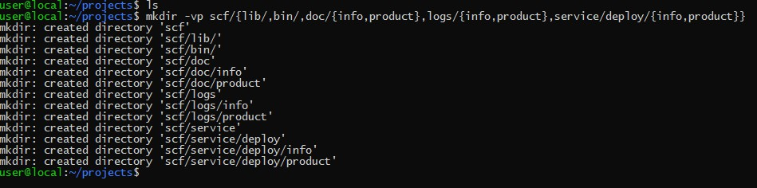

# mkdir

linux mkdir 命令用来创建指定的名称的目录，要求创建目录的用户在当前目录中具有写权限，并且指定的目录名不能是当前目录中已有的目录。

## 命令格式：

`mkdir [选项] 目录...`

## 命令功能：

通过 mkdir 命令可以实现在指定位置创建以 DirName(指定的文件名)命名的文件夹或目录。要创建文件夹或目录的用户必须对所创建的文件夹的父文件夹具有写权限。并且，所创建的文件夹(目录)不能与其父目录(即父文件夹)中的文件名重名，即同一个目录下不能有同名的(区分大小写)。 

## 命令参数：
- -m, --mode=模式，设定权限<模式> (类似 chmod)，而不是 rwxrwxrwx 减 umask
- -p, --parents  可以是一个路径名称。此时若路径中的某些目录尚不存在,加上此选项后,系统将自动建立好那些尚不存在的目录,即一次可以建立多个目录; 
- -v, --verbose  每次创建新目录都显示信息
- -Z 将每个创建的目录的SELinux安全上下文设置为默认类型
- --context[=CTX]  如-Z，或者如果指定了CTX，则设置SELinux
- --help   显示此帮助信息并退出
- --version  输出版本信息并退出

## 命令实例：

### 1. 创建一个空目录 

- 命令：`mkdir test1`

### 2. 递归创建多个目录 

- 命令：`mkdir -p test2/test22`

### 3. 创建权限为777的目录 

- 命令：`mkdir -m 777 test3`

    >test3 的权限为rwxrwxrwx

### 4. 创建新目录都显示信息

- 命令：`mkdir -v test4`

### 5. 一个命令创建项目的目录结构

- 命令：`mkdir -vp scf/{lib/,bin/,doc/{info,product},logs/{info,product},service/deploy/{info,product}}`

    