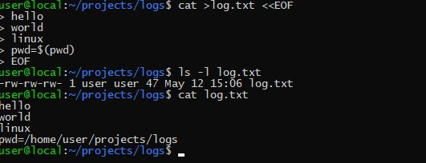

# cat

cat 命令的用途是连接文件或标准输入并打印。这个命令常用来显示文件内容，或者将几个文件连接起来显示，或者从标准输入读取内容并显示，它常与重定向符号配合使用。

## 命令格式

`cat [选项] [文件]...`

## 命令功能

cat 主要有三大功能：

1. 一次显示整个文件:cat filename

2. 从键盘创建一个文件:cat > filename 只能创建新文件,不能编辑已有文件.

3. 将几个文件合并为一个文件:cat file1 file2 > file

## 命令参数

- -A, --show-all 等价于 -vET
- -b, --number-nonblank 对非空输出行编号
- -e 等价于 -vE
- -E, --show-ends 在每行结束处显示 \$
- -n, --number 对输出的所有行编号,由 1 开始对所有输出的行数编号
- -s, --squeeze-blank 有连续两行以上的空白行，就代换为一行的空白行
- -t 与 -vT 等价
- -T, --show-tabs 将跳格字符显示为 ^I
- -u (被忽略)
- -v, --show-nonprinting 使用 ^ 和 M- 引用，除了 LFD 和 TAB 之外

## 使用实例

### 1. 把 log2012.log 的文件内容加上行号后输入 log2013.log 这个文件里

- 命令：`cat -n log2012.log log2013.log`

### 2. 把 log2012.log 和 log2013.log 的文件内容加上行号（空白行不加）之后将内容附加到 log.log 里。

- 命令：`cat -b log2012.log log2013.log log.log`

### 3. 把 log2012.log 的文件内容加上行号后输入 log.log 这个文件里

- 命令：`log.log && cat -n log2012.log > log.log`

### 4. 使用 here doc 来生成文件

## 扩展

tac (反向列示)

- 命令：`tac log.txt`

  > tac 是将 cat 反写过来，所以他的功能就跟 cat 相反， cat 是由第一行到最后一行连续显示在萤幕上，而 tac 则是由最后一行到第一行反向在萤幕上显示出来！
