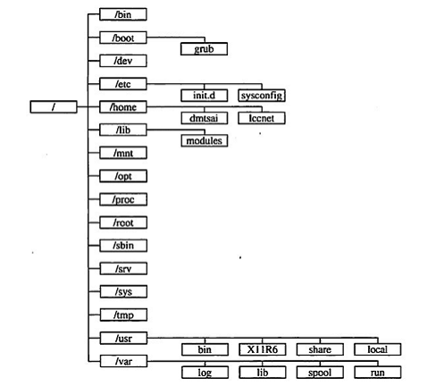

# Linux 目录结构

- `/boot`启动//内核驱动等
- `/dev`硬件
- `/etc`配置
- `/home`用户数据
- `/root`root 用户数据
- `/lib` 库
- `/mnt` 挂载
- `/opt` 大型软件安装目录
- `/proc` 内存实时信息
- `/sbin` root 用户执行命令
- `/bin` 用户执行命令
- `/tmp` 临时目录
- `/usr` 应用软件安装目录
- `/var` log 等经常变化的信息

对于每一个 Linux 学习者来说，了解 Linux 文件系统的目录结构，是学好 Linux 的至关重要的一步.，深入了解 linux 文件目录结构的标准和每个目录的详细功能，对于我们用好 linux 系统只管重要，下面我们就开始了解一下 linux 目录结构的相关知识。

当在使用 Linux 的时候，如果您通过 ls –l / 就会发现，在/下包涵很多的目录，比如 etc、usr、var、bin ... ... 等目录，而在这些目录中，我们进去看看，发现也有很多的目录或文件。文件系统在 Linux 下看上去就象树形结构，所以我们可以把文件系统的结构形象的称为 树形结构。

文件系统的是用来组织和排列文件存取的，所以她是可见的，在 Linux 中，我们可以通过 ls 等工具来查看其结构，在 Linux 系统中，我们见到的都是树形结构；比如操作系统安装在一个文件系统中，他表现为由/ 起始的树形结构。linux 文件系统的最顶端是/，我们称/为 Linux 的 root，也就是 Linux 操作系统的文件系统。Linux 的文件系统的入口就是/，所有的目录、文件、设备都在/之下，/就是 Linux 文件系统的组织者，也是最上级的领导者。

由于 linux 是开放源代码，各大公司和团体根据 linux 的核心代码做各自的操作，编程。这样就造成在根下的目录的不同。这样就造成个人不能使用他人的 linux 系统的 PC。因为你根本不知道一些基本的配置，文件在哪里。。。这就造成了混乱。这就是 FHS（Filesystem Hierarchy Standard ）机构诞生的原因。该机构是 linux 爱好者自发的组成的一个团体，主要是是对 linux 做一些基本的要求，不至于是操作者换一台主机就成了 linux 的‘文盲’。

根据 FHS<http://www.pathname.com/fhs/>的官方文件指出， 他们的主要目的是希望让使用者可以了解到已安装软件通常放置于那个目录下， 所以他们希望独立的软件开发商、操作系统制作者、以及想要维护系统的用户，都能够遵循 FHS 的标准。 也就是说，FHS 的重点在于规范每个特定的目录下应该要放置什么样子的数据而已。 这样做好处非常多，因为 Linux 操作系统就能够在既有的面貌下(目录架构不变)发展出开发者想要的独特风格。

事实上，FHS 是根据过去的经验一直再持续的改版的，FHS 依据文件系统使用的频繁与否与是否允许使用者随意更动， 而将目录定义成为四种交互作用的形态，用表格来说有点像底下这样：

| -                  | 可分享的(shareable)                                     | 不可分享的(unshareable)                      |
| ------------------ | ------------------------------------------------------- | -------------------------------------------- |
| 不变的(static)     | /usr (软件放置处) </br> /opt (第三方协力软件)           | /etc (配置文件)</br>/boot (开机与核心档)     |
| 可变动的(variable) | /var/mail (使用者邮件信箱)</br>/var/spool/news (新闻组) | /var/run (程序相关)</br>/var/lock (程序相关) |

## 四中类型

1. 可分享的：

   可以分享给其他系统挂载使用的目录，所以包括执行文件与用户的邮件等数据， 是能够分享给网络上其他主机挂载用的目录；

2. 不可分享的：

   自己机器上面运作的装置文件或者是与程序有关的 socket 文件等， 由于仅与自身机器有关，所以当然就不适合分享给其他主机了。

3. 不变的：

   有些数据是不会经常变动的，跟随着 distribution 而不变动。 例如函式库、文件说明文件、系统管理员所管理的主机服务配置文件等等；

4. 可变动的：

   经常改变的数据，例如登录文件、一般用户可自行收受的新闻组等。

事实上，FHS 针对目录树架构仅定义出三层目录底下应该放置什么数据而已，分别是底下这三个目录的定义：

```sh
/ (root, 根目录)：与开机系统有关；
/usr (unix software resource)：与软件安装/执行有关；
/var (variable)：与系统运作过程有关。
```

## 根目录 (/) 的意义与内容

根目录是整个系统最重要的一个目录，因为不但所有的目录都是由根目录衍生出来的， 同时根目录也与开机/还原/系统修复等动作有关。 由于系统开机时需要特定的开机软件、核心文件、开机所需程序、 函式库等等文件数据，若系统出现错误时，根目录也必须要包含有能够修复文件系统的程序才行。 因为根目录是这么的重要，所以在 FHS 的要求方面，他希望根目录不要放在非常大的分区， 因为越大的分区内你会放入越多的数据，如此一来根目录所在分区就可能会有较多发生错误的机会。

因此 FHS 标准建议：根目录(/)所在分区应该越小越好， 且应用程序所安装的软件最好不要与根目录放在同一个分区内，保持根目录越小越好。 如此不但效能较佳，根目录所在的文件系统也较不容易发生问题。说白了，就是根目录和 Windows 的 C 盘一个样。

根据以上原因，FHS 认为根目录(/)下应该包含如下子目录：

| 目录   | 应放置档案内容                                                                                                                                                                                                                                                                                                                                                                                                                                                                                                                                                                                                                                                                                                 |
| ------ | -------------------------------------------------------------------------------------------------------------------------------------------------------------------------------------------------------------------------------------------------------------------------------------------------------------------------------------------------------------------------------------------------------------------------------------------------------------------------------------------------------------------------------------------------------------------------------------------------------------------------------------------------------------------------------------------------------------- |
| /bin   | 系统有很多放置执行档的目录，但/bin 比较特殊。因为/bin 放置的是在单人维护模式下还能够被操作的指令。在/bin 底下的指令可以被 root 与一般帐号所使用，主要有：cat,chmod(修改权限), chown, date, mv, mkdir, cp, bash 等等常用的指令。                                                                                                                                                                                                                                                                                                                                                                                                                                                                                |
| /boot  | 主要放置开机会使用到的档案，包括 Linux 核心档案以及开机选单与开机所需设定档等等。Linux kernel 常用的档名为：vmlinuz ，如果使用的是 grub 这个开机管理程式，则还会存在/boot/grub/这个目录。                                                                                                                                                                                                                                                                                                                                                                                                                                                                                                                      |
| /dev   | 在 Linux 系统上，任何装置与周边设备都是以档案的型态存在于这个目录当中。 只要通过存取这个目录下的某个档案，就等于存取某个装置。比要重要的档案有/dev/null, /dev/zero, /dev/tty , /dev/lp*, / dev/hd*, /dev/sd\*等等                                                                                                                                                                                                                                                                                                                                                                                                                                                                                              |
| /etc   | 系统主要的设定档几乎都放置在这个目录内，例如人员的帐号密码档、各种服务的启始档等等。 一般来说，这个目录下的各档案属性是可以让一般使用者查阅的，但是只有 root 有权力修改。 FHS 建议不要放置可执行档(binary)在这个目录中。 比较重要的档案有：/etc/inittab, /etc/init.d/, /etc/modprobe.conf, /etc/X11/, /etc/fstab, /etc/sysconfig/等等。 另外，其下重要的目录有：/etc/init.d/ ：所有服务的预设启动 script 都是放在这里的，例如要启动或者关闭 iptables 的话： /etc/init.d/iptables start、/etc/init.d/ iptables stop</br>/etc/xinetd.d/ ：这就是所谓的 super daemon 管理的各项服务的设定档目录。</br>/etc/X11/ ：与 X Window 有关的各种设定档都在这里，尤其是 xorg.conf 或 XF86Config 这两个 X Server 的设定档。 |
| /home  | 这是系统预设的使用者家目录(home directory)。 在你新增一个一般使用者帐号时，预设的使用者家目录都会规范到这里来。比较重要的是，家目录有两种代号： </br>~ ：代表当前使用者的家目录，而 ~guest：则代表用户名为 guest 的家目录。                                                                                                                                                                                                                                                                                                                                                                                                                                                                                    |
| /lib   | 系统的函式库非常的多，而/lib 放置的则是在开机时会用到的函式库，以及在/bin 或/sbin 底下的指令会呼叫的函式库而已 。 什么是函式库呢？妳可以将他想成是外挂，某些指令必须要有这些外挂才能够顺利完成程式的执行之意。 尤其重要的是/lib/modules/这个目录，因为该目录会放置核心相关的模组(驱动程式)。                                                                                                                                                                                                                                                                                                                                                                                                                   |
| /media | media 是媒体的英文，顾名思义，这个/media 底下放置的就是可移除的装置。 包括软碟、光碟、DVD 等等装置都暂时挂载于此。 常见的档名有：/media/floppy, /media/cdrom 等等。                                                                                                                                                                                                                                                                                                                                                                                                                                                                                                                                            |
| /mnt   | 如果妳想要暂时挂载某些额外的装置，一般建议妳可以放置到这个目录中。在古早时候，这个目录的用途与/media 相同啦。 只是有了/media 之后，这个目录就用来暂时挂载用了。                                                                                                                                                                                                                                                                                                                                                                                                                                                                                                                                                |
| /opt   | 这个是给第三方协力软体放置的目录 。 什么是第三方协力软体啊？举例来说，KDE 这个桌面管理系统是一个独立的计画，不过他可以安装到 Linux 系统中，因此 KDE 的软体就建议放置到此目录下了。 另外，如果妳想要自行安装额外的软体(非原本的 distribution 提供的)，那么也能够将你的软体安装到这里来。 不过，以前的 Linux 系统中，我们还是习惯放置在/usr/local 目录下。                                                                                                                                                                                                                                                                                                                                                       |
| /root  | 系统管理员(root)的家目录。 之所以放在这里，是因为如果进入单人维护模式而仅挂载根目录时，该目录就能够拥有 root 的家目录，所以我们会希望 root 的家目录与根目录放置在同一个分区中。                                                                                                                                                                                                                                                                                                                                                                                                                                                                                                                                |
| /sbin  | Linux 有非常多指令是用来设定系统环境的，这些指令只有 root 才能够利用来设定系统，其他使用者最多只能用来查询而已。放在/sbin 底下的为开机过程中所需要的，里面包括了开机、修复、还原系统所需要的指令。至于某些伺服器软体程式，一般则放置到/usr/sbin/当中。至于本机自行安装的软体所产生的系统执行档(system binary)，则放置到/usr/local/sbin/当中了。常见的指令包括：fdisk, fsck, ifconfig, init, mkfs 等等。                                                                                                                                                                                                                                                                                                        |
| /srv   | srv 可以视为 service 的缩写，是一些网路服务启动之后，这些服务所需要取用的资料目录。 常见的服务例如 WWW, FTP 等等。 举例来说，WWW 伺服器需要的网页资料就可以放置在/srv/www/里面。呵呵，看来平时我们编写的代码应该放到这里了。                                                                                                                                                                                                                                                                                                                                                                                                                                                                                   |
| /tmp   | 这是让一般使用者或者是正在执行的程序暂时放置档案的地方。这个目录是任何人都能够存取的，所以你需要定期的清理一下。当然，重要资料不可放置在此目录啊。 因为 FHS 甚至建议在开机时，应该要将/tmp 下的资料都删除。                                                                                                                                                                                                                                                                                                                                                                                                                                                                                                    |

事实上 FHS 针对根目录所定义的标准就仅限于上表，不过仍旧有些目录也需要我们了解一下，具体如下：

| 目录        | 应放置档案内容                                                                                                                                                                                                                                                                                                                                                               |
| ----------- | ---------------------------------------------------------------------------------------------------------------------------------------------------------------------------------------------------------------------------------------------------------------------------------------------------------------------------------------------------------------------------- |
| /lost+found | 这个目录是使用标准的 ext2/ext3 档案系统格式才会产生的一个目录，目的在于当档案系统发生错误时，将一些遗失的片段放置到这个目录下。 这个目录通常会在分割槽的最顶层存在，例如你加装一个硬盘于/disk 中，那在这个系统下就会自动产生一个这样的目录/disk/lost+found                                                                                                                   |
| /proc       | 这个目录本身是一个虚拟文件系统(virtual filesystem)喔。 他放置的资料都是在内存当中，例如系统核心、行程资讯(process)（是进程吗?）、周边装置的状态及网络状态等等。因为这个目录下的资料都是在记忆体（内存）当中，所以本身不占任何硬盘空间。比较重要的档案（目录）例如： /proc/cpuinfo, /proc/dma, /proc/interrupts, /proc/ioports, /proc/net/\*等等。呵呵，是虚拟内存吗[guest]？ |
| /sys        | 这个目录其实跟/proc 非常类似，也是一个虚拟的档案系统，主要也是记录与核心相关的资讯。 包括目前已载入的核心模组与核心侦测到的硬体装置资讯等等。 这个目录同样不占硬盘容量。                                                                                                                                                                                                     |

除了这些目录的内容之外，另外要注意的是，因为根目录与开机有关，开机过程中仅有根目录会被挂载， 其他分区则是在开机完成之后才会持续的进行挂载的行为。就是因为如此，因此根目录下与开机过程有关的目录， 就不能够与根目录放到不同的分区去。那哪些目录不可与根目录分开呢？有底下这些：

- /etc：配置文件
- /bin：重要执行档
- /dev：所需要的装置文件
- /lib：执行档所需的函式库与核心所需的模块
- /sbin：重要的系统执行文件

这五个目录千万不可与根目录分开在不同的分区。请背下来啊。

## /usr 的意义与内容

依据 FHS 的基本定义，/usr 里面放置的数据属于可分享的与不可变动的(shareable, static)， 如果你知道如何透过网络进行分区的挂载(例如在服务器篇会谈到的 NFS 服务器)，那么/usr 确实可以分享给局域网络内的其他主机来使用喔。

/usr 不是 user 的缩写，其实 usr 是 Unix Software Resource 的缩写， 也就是 Unix 操作系统软件资源所放置的目录，而不是用户的数据啦。这点要注意。 FHS 建议所有软件开发者，应该将他们的数据合理的分别放置到这个目录下的次目录，而不要自行建立该软件自己独立的目录。

因为是所有系统默认的软件(distribution 发布者提供的软件)都会放置到/usr 底下，因此这个目录有点类似 Windows 系统的 C:\Windows\ + C:\Program files\这两个目录的综合体，系统刚安装完毕时，这个目录会占用最多的硬盘容量。 一般来说，/usr 的次目录建议有底下这些：

| 目录          | 应放置档案内容                                                                                                                                                                                                                                                                                                                                          |
| ------------- | ------------------------------------------------------------------------------------------------------------------------------------------------------------------------------------------------------------------------------------------------------------------------------------------------------------------------------------------------------- |
| /usr/X11R6/   | 为 X Window System 重要数据所放置的目录，之所以取名为 X11R6 是因为最后的 X 版本为第 11 版，且该版的第 6 次释出之意。                                                                                                                                                                                                                                    |
| /usr/bin/     | 绝大部分的用户可使用指令都放在这里。请注意到他与/bin 的不同之处。(是否与开机过程有关)                                                                                                                                                                                                                                                                   |
| /usr/include/ | c/c++等程序语言的档头(header)与包含档(include)放置处，当我们以 tarball 方式 (\*.tar.gz 的方式安装软件)安装某些数据时，会使用到里头的许多包含档。                                                                                                                                                                                                        |
| /usr/lib/     | 包含各应用软件的函式库、目标文件(object file)，以及不被一般使用者惯用的执行档或脚本(script)。 某些软件会提供一些特殊的指令来进行服务器的设定，这些指令也不会经常被系统管理员操作， 那就会被摆放到这个目录下啦。要注意的是，如果你使用的是 X86_64 的 Linux 系统， 那可能会有/usr/lib64/目录产生                                                          |
| /usr/local/   | 系统管理员在本机自行安装自己下载的软件(非 distribution 默认提供者)，建议安装到此目录， 这样会比较便于管理。举例来说，你的 distribution 提供的软件较旧，你想安装较新的软件但又不想移除旧版， 此时你可以将新版软件安装于/usr/local/目录下，可与原先的旧版软件有分别啦。 你可以自行到/usr/local 去看看，该目录下也是具有 bin, etc, include, lib...的次目录 |
| /usr/sbin/    | 非系统正常运作所需要的系统指令。最常见的就是某些网络服务器软件的服务指令(daemon)                                                                                                                                                                                                                                                                        |
| /usr/share/   | 放置共享文件的地方，在这个目录下放置的数据几乎是不分硬件架构均可读取的数据， 因为几乎都是文本文件嘛。在此目录下常见的还有这些次目录：/usr/share/man：联机帮助文件</br>/usr/share/doc：软件杂项的文件说明</br>/usr/share/zoneinfo：与时区有关的时区文件                                                                                                  |
| /usr/src/     | 一般原始码建议放置到这里，src 有 source 的意思。至于核心原始码则建议放置到/usr/src/linux/目录下。                                                                                                                                                                                                                                                       |

## /var 的意义与内容

如果/usr 是安装时会占用较大硬盘容量的目录，那么/var 就是在系统运作后才会渐渐占用硬盘容量的目录。 因为/var 目录主要针对常态性变动的文件，包括缓存(cache)、登录档(log file)以及某些软件运作所产生的文件， 包括程序文件(lock file, run file)，或者例如 MySQL 数据库的文件等等。常见的次目录有：

| 目录        | 应放置档案内容                                                                                                                                                                                                                                                                                                                                                                                                               |
| ----------- | ---------------------------------------------------------------------------------------------------------------------------------------------------------------------------------------------------------------------------------------------------------------------------------------------------------------------------------------------------------------------------------------------------------------------------- |
| /var/cache/ | 应用程序本身运作过程中会产生的一些暂存档                                                                                                                                                                                                                                                                                                                                                                                     |
| /var/lib/   | 程序本身执行的过程中，需要使用到的数据文件放置的目录。在此目录下各自的软件应该要有各自的目录。 举例来说，MySQL 的数据库放置到/var/lib/mysql/而 rpm 的数据库则放到/var/lib/rpm 去                                                                                                                                                                                                                                             |
| /var/lock/  | 某些装置或者是文件资源一次只能被一个应用程序所使用，如果同时有两个程序使用该装置时， 就可能产生一些错误的状况，因此就得要将该装置上锁(lock)，以确保该装置只会给单一软件所使用。 举例来说，刻录机正在刻录一块光盘，你想一下，会不会有两个人同时在使用一个刻录机烧片？ 如果两个人同时刻录，那片子写入的是谁的数据？所以当第一个人在刻录时该刻录机就会被上锁， 第二个人就得要该装置被解除锁定(就是前一个人用完了)才能够继续使用 |
| /var/log/   | 非常重要。这是登录文件放置的目录。里面比较重要的文件如/var/log/messages, /var/log/wtmp(记录登入者的信息)等。                                                                                                                                                                                                                                                                                                                 |
| /var/mail/  | 放置个人电子邮件信箱的目录，不过这个目录也被放置到/var/spool/mail/目录中，通常这两个目录是互为链接文件。                                                                                                                                                                                                                                                                                                                     |
| /var/run/   | 某些程序或者是服务启动后，会将他们的 PID 放置在这个目录下                                                                                                                                                                                                                                                                                                                                                                    |
| /var/spool/ | 这个目录通常放置一些队列数据，所谓的“队列”就是排队等待其他程序使用的数据。 这些数据被使用后通常都会被删除。举例来说，系统收到新信会放置到/var/spool/mail/中， 但使用者收下该信件后该封信原则上就会被删除。信件如果暂时寄不出去会被放到/var/spool/mqueue/中， 等到被送出后就被删除。如果是工作排程数据(crontab)，就会被放置到/var/spool/cron/目录中。                                                                         |

由于 FHS 仅是定义出最上层(/)及次层(/usr, /var)的目录内容应该要放置的文件或目录数据， 因此，在其他次目录层级内，就可以随开发者自行来配置了。

## 目录树(directory tree)

在 Linux 底下，所有的文件与目录都是由根目录开始的。那是所有目录与文件的源头, 然后再一个一个的分支下来，因此，我们也称这种目录配置方式为：目录树(directory tree), 这个目录树的主要特性有：

目录树的启始点为根目录 (/, root)；

每一个目录不止能使用本地端的 partition 的文件系统，也可以使用网络上的 filesystem 。举例来说， 可以利用 Network File System (NFS) 服务器挂载某特定目录等。

每一个文件在此目录树中的文件名(包含完整路径)都是独一无二的。

如果我们将整个目录树以图的方法来显示，并且将较为重要的文件数据列出来的话，那么目录树架构就如下图所示：



## 绝对路径与相对路径

除了需要特别注意的 FHS 目录配置外，在文件名部分我们也要特别注意。因为根据档名写法的不同，也可将所谓的路径(path)定义为绝对路径(absolute)与相对路径(relative)。 这两种文件名/路径的写法依据是这样的：

1. 绝对路径：

   由根目录(/)开始写起的文件名或目录名称， 例如 /home/dmtsai/.bashrc；

2. 相对路径：

   相对于目前路径的文件名写法。 例如 ./home/dmtsai 或 <http://www.cnblogs.com/home/dmtsai/> 等等。反正开头不是 / 就属于相对路径的写法

而你必须要了解，相对路径是以你当前所在路径的相对位置来表示的。举例来说，你目前在 /home 这个目录下， 如果想要进入 /var/log 这个目录时，可以怎么写呢？

```sh
cd /var/log   (absolute)
cd ../var/log (relative)
```

因为你在 /home 底下，所以要回到上一层 (../) 之后，才能继续往 /var 来移动的，特别注意这两个特殊的目录：

- `.` ：代表当前的目录，也可以使用 `./` 来表示；
- `..` ：代表上一层目录，也可以 `../` 来代表。

这个 . 与 .. 目录概念是很重要的，你常常会看到 cd .. 或 ./command 之类的指令下达方式， 就是代表上一层与目前所在目录的工作状态。
